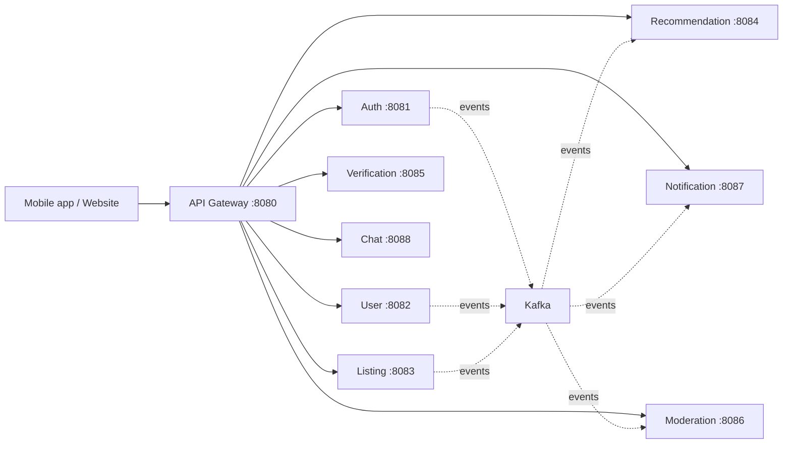

# Service architecture

## Bounded contexts and ownership

| Context | Service | Data it owns |
| --- | --- | --- |
| Edge routing | API Gateway | No business data |
| Identity and sessions | Auth Service | Credential hash, verified contact flags, refresh-token sessions |
| Marketplace identity | User Service | Profile, move-in/budget details, roommate preferences |
| Listings | Listing Service | Properties, rooms, prices, availability, amenities |
| Compatibility/ranking | Recommendation Service | Recommendation features, scores, interaction aggregates |
| Identity review | Verification Service | Verification workflow and provider references |
| Trust and safety | Moderation Service | Reports, blocks, violations, audit actions |
| Delivery | Notification Service | Notification preferences and delivery records |
| Conversations | Chat Service | Conversations, messages, read receipts |

Each data-owning service has its own database. A service never reads or writes another service's tables. Stable identifiers and versioned HTTP/Kafka contracts are the integration boundary.

## Security baseline

- Passwords are BCrypt hashes; raw passwords are never logged or returned.
- Access tokens are short-lived JWTs (15 minutes); refresh tokens are opaque, hashed server-side, rotated, and revocable.
- Protected endpoints obtain the subject only from a validated Bearer token.
- CORS is allow-list based through `APP_CORS_ALLOWED_ORIGINS`.
- Production secrets are environment variables; development fallback values are deliberately limited to the `dev` profile.

No business API has been implemented yet. We will add and review each service's API, schema, authorization rules, and event contracts independently.
